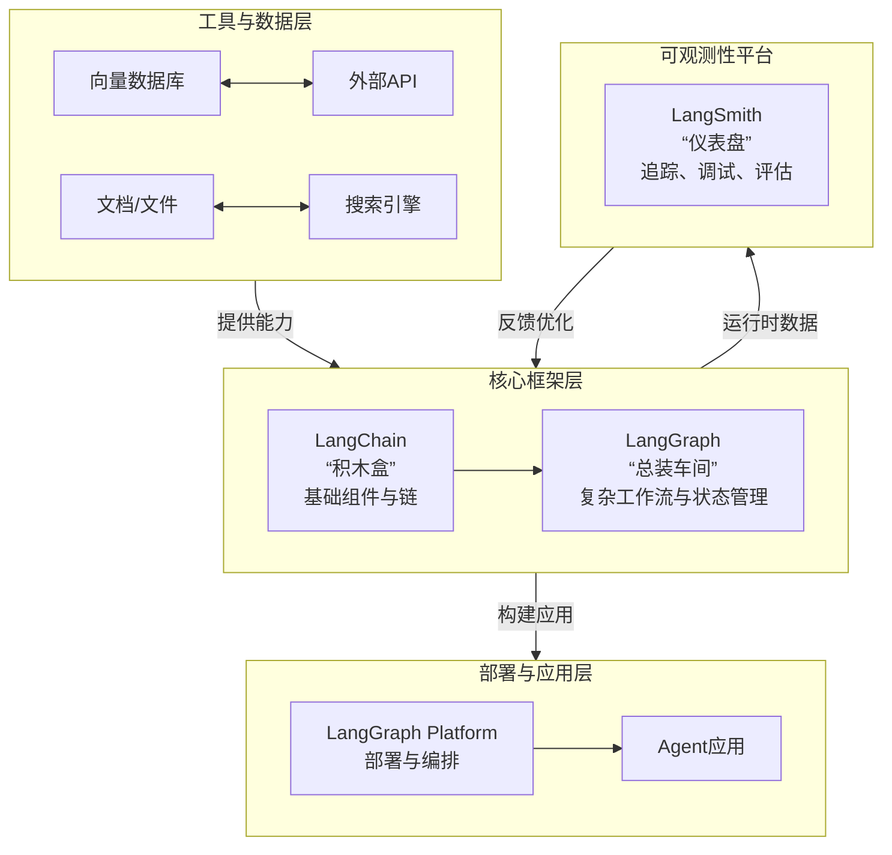
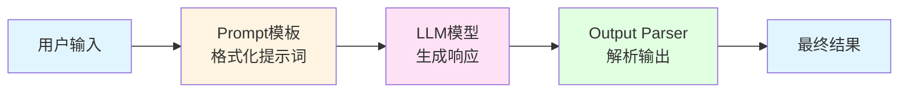
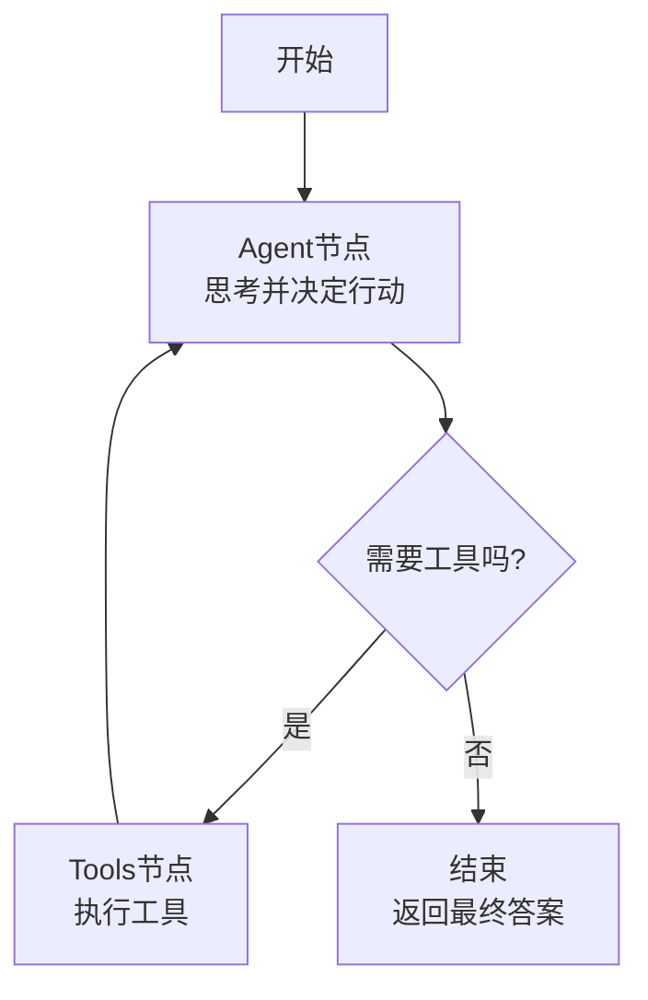

# 一、概念图

## LangChain：你的"AI应用积木盒"

它主要负责提供标准化、模块化的基础组件。你可以把它想象成一个功能齐全的工具箱：

- **统一模型接口**：用同样的方式调用不同的 AI 模型（如 OpenAI、Anthropic 等）
- **丰富的工具集成**：内置或方便地接入搜索引擎、文档处理器、向量数据库等
- **链式编排（LCEL）**：使用 `|` 管道符，像搭积木一样将提示词、模型、解析器等组件连接成线性的执行链，适合简单、确定性的任务

## LangGraph：你的"智能体总装车间"

当任务变得复杂，需要根据中间结果动态决策、循环或并行执行时，就需要 LangGraph。它的核心是用"图"来定义工作流：

- **节点（Node）**：代表一个处理步骤，比如调用一次 LLM、执行一个工具
- **边（Edge）**：定义节点之间的流转逻辑，可以是固定的，也可以是条件分支
- **状态（State）**：贯穿整个工作流的共享数据存储，所有节点都能读写，这是实现复杂多轮交互的关键

简单来说，LangChain 提供了高质量的"零件"（组件），而 LangGraph 则提供了设计复杂"机器"（智能体）的蓝图和方法。

## LangSmith：你的"智能体仪表盘"

开发智能体时，调试和优化常常比传统软件更复杂。LangSmith 就是一个专为 AI 应用设计的可观测性平台：

- **追踪（Tracing）**：可视化查看每一次调用的完整链路，包括经过了哪些节点、状态如何变化
- **调试（Debugging）**：可以检查每一步的输入和输出，快速定位问题
- **评估（Evaluation）**：对智能体的表现进行测试和评分，帮助迭代优化