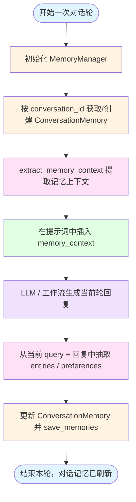

## 概述

`challenge_memory.py` 实现了一个**独立的对话记忆子系统**，用于为智能体提供「跨轮次的长期记忆」。  
当前版本是**纯本地实现**，只依赖标准库，不直接调用 LLM，方便在任意环境下运行和调试。

核心功能包括：
- 为每个 `conversation_id` 维护一份结构化记忆；
- 支持实体（entities）、偏好（preferences）、摘要（summary）等信息的累积更新；
- 将记忆持久化到本地 `memory_storage.json`；
- 提供 `extract_memory_context` 接口，用于在生成回复前插入「与当前问题相关的历史信息」。

---

## 核心数据结构

### 1. `ConversationMemory`

```python
@dataclass
class ConversationMemory:
    conversation_id: str
    user_id: str = "default"
    context_window: int = 10  # 记忆的对话轮数
    summary: str = ""         # 对话摘要
    entities: Dict[str, Any] = None  # 识别的实体
    preferences: List[str] = None    # 用户偏好
    created_at: str = None
    updated_at: str = None
```

**字段说明：**
- `conversation_id`：会话唯一标识，同一会话多轮对话共享同一记忆对象。
- `user_id`：用户标识，默认 `"default"`，可拓展为多用户场景。
- `context_window`：预留给未来按「最近 N 轮对话」裁剪记忆的窗口（当前版本尚未使用）。
- `summary`：对该会话的简要摘要（例如「用户是学习 AI 编程的初学者」）。
- `entities`：从对话中抽取出的实体信息（如「兴趣: AI 编程」「项目名称: LangGraph Demo」）。
- `preferences`：用户偏好标签（如「喜欢详细解释」「需要示例代码」）。
- `created_at / updated_at`：ISO 时间戳，记录记忆的创建与最近更新时间。

`__post_init__` 中负责填充默认值，保证外部使用时字段总是有合理初始状态：
- 没有 `created_at` / `updated_at` 时自动填充当前时间；
- `entities` / `preferences` 默认为空字典 / 空列表。

### 2. `MemoryManager`

```python
class MemoryManager:
    def __init__(self, storage_path: str = "memory_storage.json"):
        self.storage_path = storage_path
        self.memories: Dict[str, ConversationMemory] = self._load_memories()
```

`MemoryManager` 负责：
- 从本地 JSON 文件加载历史记忆；
- 提供按 `conversation_id` 获取 / 创建记忆的接口；
- 把内存中的所有记忆统一持久化写回磁盘；
- 提供「根据当前 query 提取上下文」的高层接口。

---

## 记忆更新与摘要逻辑

### 1. `ConversationMemory.update`

```python
def update(self, new_interaction: Dict[str, Any]):
    self.updated_at = datetime.now().isoformat()

    # 更新实体
    if "entities" in new_interaction:
        for key, value in new_interaction["entities"].items():
            self.entities[key] = value

    # 更新偏好
    if "preferences" in new_interaction:
        for pref in new_interaction["preferences"]:
            if pref not in self.preferences:
                self.preferences.append(pref)

    # 如果对话太长，生成摘要
    if len(self.entities) > 20 or len(self.preferences) > 10:
        self._summarize()
```

**要点：**
- 每次更新都会刷新 `updated_at`。
- `entities` 字段采用「覆盖式累积」，相同 key 会被最新值替换。
- `preferences` 列表去重追加，避免同一偏好重复出现。
- 当实体或偏好数量超过一定阈值时，调用 `_summarize` 生成简要摘要，避免上下文膨胀。

### 2. 简易摘要 `_summarize`

```python
def _summarize(self):
    entity_summary = ", ".join(list(self.entities.keys())[:5])
    pref_summary = ", ".join(self.preferences[:3])
    self.summary = f"对话涉及: {entity_summary}。偏好: {pref_summary}"
```

当前版本使用**规则模板**进行摘要：
- 从实体 key 中取前 5 个；
- 从偏好中取前 3 条；
- 拼出一条简短的概要描述。

在接入 LLM 后，可以替换为「让模型根据 entities / preferences / 历史消息生成更自然的摘要」。

---

## 持久化与加载流程

### 1. 加载 `_load_memories`

```python
def _load_memories(self) -> Dict[str, ConversationMemory]:
    if os.path.exists(self.storage_path):
        try:
            with open(self.storage_path, 'r', encoding='utf-8') as f:
                data = json.load(f)
            memories = {
                conv_id: ConversationMemory(**mem_data)
                for conv_id, mem_data in data.items()
            }
            return memories
        except Exception as e:
            print(f"加载记忆失败: {e}")
    return {}
```

**特点：**
- 启动时一次性从 `memory_storage.json` 加载全部会话的记忆；
- 每条记录通过 `ConversationMemory(**mem_data)` 还原为数据类实例；
- 出现解析错误时打印日志并返回空字典，保证不影响主流程。

### 2. 保存 `save_memories`

```python
def save_memories(self):
    data = {
        conv_id: memory.to_dict()
        for conv_id, memory in self.memories.items()
    }
    with open(self.storage_path, 'w', encoding='utf-8') as f:
        json.dump(data, f, ensure_ascii=False, indent=2)
```

**注意点：**
- 使用 `to_dict()` + `json.dump`，便于调试和手动查看。
- 覆盖写入，同一文件始终保持最新快照。

---

## 上下文提取：让 Agent 看到「历史」

### 1. 接口 `extract_memory_context`

```python
def extract_memory_context(self, conversation_id: str, current_query: str) -> str:
    if conversation_id not in self.memories:
        return ""

    memory = self.memories[conversation_id]
    context_parts = []

    if memory.summary:
        context_parts.append(f"对话摘要: {memory.summary}")

    if memory.entities:
        recent_entities = list(memory.entities.items())[-3:]
        entity_str = ", ".join([f"{k}: {v}" for k, v in recent_entities])
        context_parts.append(f"最近提到的: {entity_str}")

    if memory.preferences:
        prefs = ", ".join(memory.preferences[-3:])
        context_parts.append(f"用户偏好: {prefs}")

    return "\n".join(context_parts) if context_parts else ""
```

**输出示例：**

```text
对话摘要: 对话涉及: 用户, 兴趣。偏好: 喜欢详细解释, 需要示例代码
最近提到的: 兴趣: AI编程, 用户: 学习者
用户偏好: 喜欢详细解释, 需要示例代码
```

上层的 Agent 可以在构造提示词时，将这段文本插入到 System / Context 部分，从而让模型「记住」过去的信息。

---

## 与 LangGraph 的集成思路

文件中给出了一个示例状态结构和规划节点，用于演示如何将记忆系统接入 LangGraph：

### 1. 增强状态 `MemoryEnhancedState`

```python
class MemoryEnhancedState(TypedDict):
    messages: Annotated[List, add_messages]
    conversation_id: str
    memory_context: str
    user_id: str
    next_node: str
```

**新增字段：**
- `conversation_id` / `user_id`：用于索引对应的 `ConversationMemory`。
- `memory_context`：从记忆系统提取出的上下文文本，供后续节点使用。
- `next_node`：与其他示例（如 `challenge_multi_tool.py`）一致，用于路由控制。

### 2. 记忆增强规划节点 `memory_enhanced_planning`

```python
def memory_enhanced_planning(state: MemoryEnhancedState):
    memory_manager = MemoryManager()

    # 获取或创建记忆
    memory = memory_manager.get_memory(state["conversation_id"], state["user_id"])

    # 提取记忆上下文
    current_query = state["messages"][-1].content if state["messages"] else ""
    memory_context = memory_manager.extract_memory_context(
        state["conversation_id"],
        current_query,
    )
    state["memory_context"] = memory_context

    planning_prompt = f"""
    历史对话记忆：
    {memory_context}

    当前问题：{current_query}

    请考虑对话历史来回答或处理当前问题。
    """

    # 这里可以接入 LLM 进行带记忆的规划 / 回答
    # ...

    # 简单的实体/偏好更新示例
    entities = {}
    if "时间" in current_query:
        entities["时间查询"] = "用户询问时间相关"
    if "计算" in current_query or "等于" in current_query:
        entities["计算需求"] = "用户需要数学计算"

    memory.update({
        "entities": entities,
        "preferences": ["需要详细计算"] if "计算" in current_query else [],
    })

    memory_manager.save_memories()
    return state
```

**集成方式要点：**
- 在进入主要规划 / 推理节点前调用 `MemoryManager`，先把 `memory_context` 写入状态。
- 在规划或回答完成后，基于当前对话内容 + 模型输出反向更新 `entities` / `preferences` 等。
- 最后将更新后的记忆持久化，以便后续轮次继续使用。

---

## 流程图：记忆读写与 Agent 交互



---

## 使用示例

### 1. 独立测试记忆系统

直接运行文件：

```bash
cd neural-upgrade/langchain/code-demo
python challenge_memory.py
```

当前 `__main__` 做的事情：
- 创建 `MemoryManager` 实例；
- 为 `conversation_id = "test_conv_001"` 写入若干实体与偏好；
- 调用 `extract_memory_context` 打印一条「记忆上下文」；
- 将记忆写入 `memory_storage.json`。

### 2. 在其他 Agent 中使用

在例如 `challenge_multi_tool.py` / `challenge_math_expert.py` 中：

```python
from challenge_memory import MemoryManager

memory_manager = MemoryManager()
memory = memory_manager.get_memory(conversation_id, user_id)
memory_context = memory_manager.extract_memory_context(conversation_id, current_query)

# 在构造 System Prompt 时插入 memory_context
system_prompt = f"""
历史对话记忆：
{memory_context}

当前问题：{current_query}
"""
```

---

## 总结

- `challenge_memory.py` 提供了一个**轻量级、本地可运行的记忆模块**：
  - 数据结构：`ConversationMemory` 抽象了会话层面的长期记忆；
  - 管理器：`MemoryManager` 负责加载 / 保存 / 提取上下文；
  - 与 LangGraph 集成示例：`MemoryEnhancedState` + `memory_enhanced_planning`。
- 它可以作为更复杂 Agent 的基础组件，与多工具工作流、数学专家等模块组合，构建具备长期记忆能力的智能体系统。

