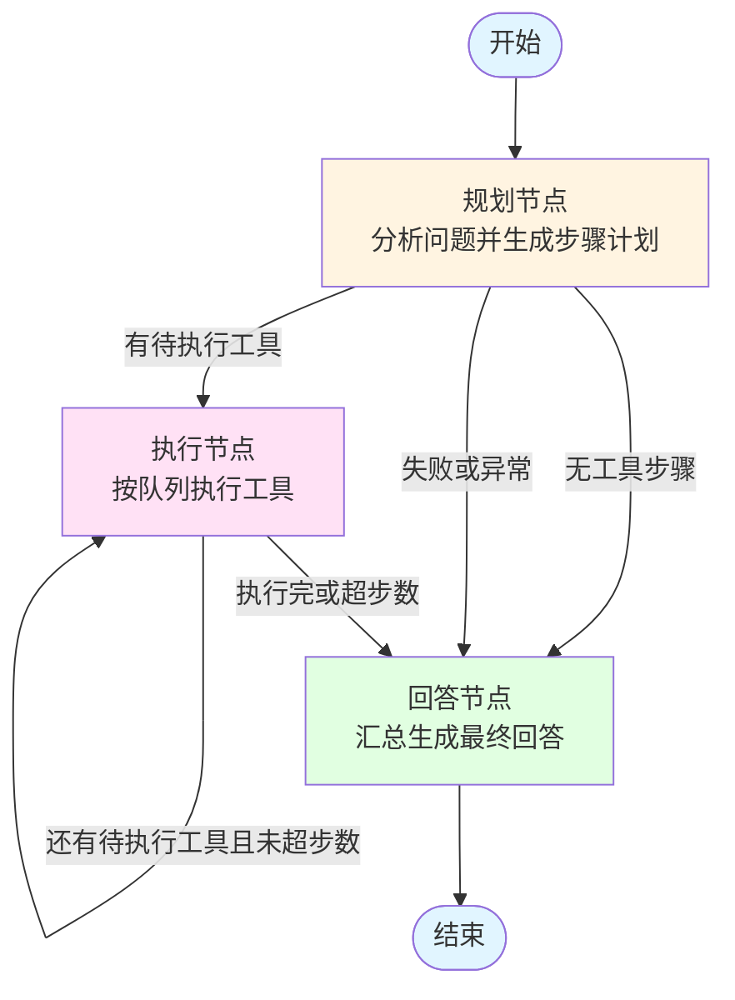

## 概述

`challenge_multi_tool.py` 实现了一个「多工具连续调用」的 LangGraph 工作流。  
它的目标是：**面对一个复杂自然语言问题，由 LLM 先规划步骤，再按规划自动串联多个工具执行，最后汇总所有结果生成自然语言回答。**

典型问题示例：
- 「现在的时间加上 30 分钟是多少？」
- 「把 5 公里转换成米，再加上 500 厘米，一共是多少米？」
- 「计算圆的面积，半径是 7.5 厘米，结果用平方毫米表示」
- 「100 美元换成人民币，再加上 500 欧元换成人民币，一共是多少人民币？」

---

## 架构设计

### 1. 状态结构 `MultiToolState`

工作流通过 `MultiToolState` 在各节点之间传递上下文：

```python
class MultiToolState(TypedDict):
    messages: Annotated[List, add_messages]  # 对话历史
    tool_calls: List[Dict[str, Any]]         # 本次会话的所有工具调用记录
    pending_tools: List[Dict[str, Any]]      # 待执行工具队列
    current_step: str                        # 当前步骤描述
    max_steps: int                           # 最大步骤限制
    step_count: int                          # 已执行步骤计数
```

**字段说明：**
- `messages`：LangChain 消息列表，记录用户提问、规划说明、工具结果、小结等。
- `tool_calls`：结构化记录每一次工具调用（步骤编号、输入、输出、是否成功、时间戳等）。
- `pending_tools`：规划节点输出的「待执行工具步骤队列」，由执行节点逐个消费。
- `current_step`：当前进展的描述性文本（主要用于调试日志）。
- `max_steps`：安全阈值，防止规划失控导致无限循环。
- `step_count`：已经执行成功的工具步骤计数。

---

### 2. 工具集

文件中通过 `@tool` 定义了 4 个可调用工具：

- `calculator(expression: str) -> float`  
  - 安全数学计算，支持 `+ - * / ^ sqrt sin cos tan log` 等。
  - 对 `^ × ÷ π Π` 等符号做预处理，再用受限 `eval` 计算。

- `get_current_time(format: str = "full") -> str`  
  - 获取当前时间。
  - `format="full" | "date" | "time"` 分别返回完整时间、日期、时间部分。

- `unit_converter(value: float, from_unit: str, to_unit: str) -> float`  
  - 单位换算：长度（m/km/cm）、重量（kg/g/lb）、温度（C/F/K）。
  - 使用字典映射 + lambda 实现。

- `currency_converter(amount: float, from_currency: str, to_currency: str) -> str`  
  - 使用**模拟汇率**进行部分币种换算（USD/CNY/EUR/JPY/GBP）。
  - 返回带注释的字符串，例如「100 USD = 720.00 CNY (汇率: 7.2)」。

所有工具汇总为：

```python
tools = [calculator, get_current_time, unit_converter, currency_converter]
tools_dict = {tool.name: tool for tool in tools}
```

`tools_dict` 用于执行节点按名称调用对应工具。

---

### 3. 模型初始化

统一使用 ARK OpenAI 兼容接口：

```python
ARK_API_KEY = os.getenv("ARK_API_KEY")
ARK_MODEL = os.getenv("ARK_MODEL")
ARK_BASE_URL = os.getenv("ARK_BASE_URL")

llm = ChatOpenAI(
    model=ARK_MODEL,
    api_key=ARK_API_KEY,
    base_url=ARK_BASE_URL,
    temperature=0.1,
)
```

**注意：**
- 不再使用 `dotenv.load_dotenv()`，环境变量需要在运行环境中自行配置。

---

## 节点设计

工作流包含 3 个核心节点：

- **规划节点 `planning_node`**：用 LLM 生成多步骤执行计划，并填充 `pending_tools`。
- **执行节点 `execution_node`**：从 `pending_tools` 中依次取出工具任务执行，记录结果。
- **回答节点 `answer_node`**：根据工具执行历史，用 LLM 生成最终自然语言回答。

### 1. 规划节点 `planning_node`

**职责：**
- 读取用户最新问题（`state["messages"][-1]`）。
- 生成包含分析和步骤列表的 JSON 计划。
- 初始化 `pending_tools` 队列和规划记录。

**核心逻辑：**

1. 生成工具描述文本：

```python
tools_desc = render_text_description(tools)
```

2. 构造提示词，请 LLM 按固定 JSON 模板返回：

```python
{
  "analysis": "问题分析",
  "steps": [
    {
      "step": 1,
      "description": "步骤描述",
      "tool_required": true/false,
      "tool_name": "工具名（如果需要）",
      "tool_input": {"参数": "值"},
      "depends_on": []
    }
  ],
  "expected_output": "最终输出形式"
}
```

3. 解析 `response.content` 为 `plan`，从 `plan["steps"]` 中筛出 `tool_required == true` 的步骤，构造 `pending_tools`：

```python
pending_tools.append({
    "step": step["step"],
    "description": step["description"],
    "tool_name": step["tool_name"],
    "tool_input": step["tool_input"],
})
```

4. 更新状态：
- 写入 `pending_tools`
- 写入 `current_step`、`step_count=0`
- 在 `tool_calls` 中追加一条 `"type": "planning"` 的规划记录。
- 在 `messages` 中追加一条简要的「规划分析」AI 消息。
- 根据是否有待执行工具设置：
  - `next_node = "execution"` 或
  - `next_node = "answer"`。

如果 JSON 解析失败，则直接设置 `next_node = "answer"`，走「无规划降级流程」。

---

### 2. 执行节点 `execution_node`

**职责：**
- 从 `pending_tools` 队列中取出第一个任务，调用对应工具。
- 把执行结果记录到 `tool_calls` 和 `messages`。
- 根据是否还有剩余任务，决定是否继续执行。

**主要流程：**

1. 如果 `pending_tools` 为空，直接跳到回答节点：
   - `next_node = "answer"`。

2. 否则从队列头部 `pop(0)` 一个步骤：
   - 取出 `step_num / tool_name / tool_input / description`。

3. 调用工具：
   - 如果 `tool_input` 是 `dict`，直接传给 `invoke()`（由 LangChain 工具层做参数匹配和校验）。
   - 否则转为字符串传入。

4. 构造一条工具调用记录：

```python
tool_record = {
    "step": step_num,
    "tool": tool_name,
    "input": tool_input,
    "output": str(result),
    "success": True,
    "timestamp": datetime.now().isoformat(),
}
```

并写入：
- `tool_calls.append(tool_record)`
- `step_count += 1`

5. 在 `messages` 中追加一条 AI 消息，说明该步骤完成及其结果。

6. 异常时：
- 捕获异常，构造 `success=False` 的工具记录。
- 不抛出异常，中断当前步骤后继续流转。

7. 决策下一节点：
- 如果还有 `pending_tools` 且 `step_count < max_steps`：
  - `next_node = "execution"`（继续下一个工具）。
- 否则：
  - `next_node = "answer"`。

---

### 3. 回答节点 `answer_node`

**职责：**
- 汇总工具执行历史。
- 将原始问题 + 工具历史作为上下文，交给 LLM 生成最终回答。

**流程：**

1. 遍历 `tool_calls`，跳过 `"type": "planning"` 的记录，构造可读的文本历史，例如：

```text
步骤1: get_current_time -> 2026年02月10日 23:14:01 ✓
步骤2: unit_converter -> 5000.0 ✓
步骤3: calculator -> 错误：... ✗
```

2. 构造提示词：
- SystemMessage：包含原始问题和「工具执行历史」。
- HumanMessage：简单指令「请基于以上信息给出最终回答」。

3. `llm.invoke()` 生成回答，将内容追加到 `messages` 中，并打印输出。

4. 设置 `next_node = "__end__"`，在图中会走向 `END`。

---

## 图的构建与执行流程

### 1. 图结构

```python
def build_multi_tool_graph():
    workflow = StateGraph(MultiToolState)

    workflow.add_node("planning", planning_node)
    workflow.add_node("execution", execution_node)
    workflow.add_node("answer", answer_node)

    workflow.set_entry_point("planning")

    def route_next(state):
        return state.get("next_node", "__end__")

    workflow.add_conditional_edges("planning", route_next, {
        "execution": "execution",
        "answer": "answer",
        "__end__": END,
    })

    workflow.add_conditional_edges("execution", route_next, {
        "execution": "execution",
        "answer": "answer",
        "__end__": END,
    })

    workflow.add_conditional_edges("answer", route_next, {
        "__end__": END,
    })

    return workflow.compile()
```

**特点：**
- 使用 `next_node` 作为统一路由字段，所有节点通过写入它来控制后续走向。
- 只有一个入口节点 `planning`。
- 结束条件统一为 `next_node="__end__"` 或节点自然流向 `END`。

---

### 2. 流程图（Mermaid）



---

## 测试用例与执行路径

在 `test_multi_tool()` 中预置了 4 个测试问题：

1. **时间问题**：「现在的时间加上 30 分钟是多少？」
   - 规划：`get_current_time` + （通常期望再计算加 30 分钟）
   - 实际执行：当前实现中只真正调用 `get_current_time`，LLM 在回答节点中自行完成「+30 分钟」的推理和描述。

2. **单位换算与加法**：「5 公里 → 米 + 500 厘米 → 米」
   - 规划：`unit_converter`（km→m） + `unit_converter`（cm→m） + `calculator`（两者相加）。
   - 当前实现中，LLM 会生成形如 `step1_result + step2_result` 的表达式，`calculator` 环境中找不到这些变量，执行会报错，但最终回答仍由 LLM 在回答节点里根据自然语言重新计算。

3. **圆面积 + 单位转换**：「半径 7.5 cm，面积用 mm² 表示」
   - 规划：平方 → 乘 π → ×100。
   - 同样存在 `step1_result / step2_result` 变量名无法在 `calculator` 环境中引用的问题；LLM 在回答节点中重新手算并给出正确结果。

4. **货币换算与求和**：「100 USD + 500 EUR → CNY」
   - 规划：两次 `currency_converter` + `calculator` 求和。
   - 当前版本中，规划生成参数名 `from / to`，而工具签名是 `from_currency / to_currency`，导致 pydantic 校验错误；回答节点则退化为解释性回答。

> 这些用例展示了：**即使部分工具步骤失败，最终回答节点仍能依靠 LLM 和已有信息给出合理解释或答案**。

---

## 使用方式

### 1. 环境变量

在终端中设置：

```bash
export ARK_API_KEY="your-api-key"
export ARK_MODEL="your-model-name"
export ARK_BASE_URL="https://your-ark-endpoint"
```

### 2. 安装依赖（示例）

```bash
pip install "langchain>=0.3" "langgraph>=0.2" langchain-openai python-dotenv sympy numpy
```

### 3. 运行示例

```bash
cd neural-upgrade/langchain/code-demo
python challenge_multi_tool.py
```

终端会依次输出 4 个测试用例的规划日志、工具调用日志和最终回答。

---

## 总结

- `challenge_multi_tool.py` 展示了一个**规划 → 执行 → 汇总**的多工具工作流模板。
- 优点：
  - 规划逻辑与执行逻辑清晰解耦；
  - 支持记录完整工具调用历史，便于调试与审计；
  - 工具失败时，整体对话仍然可以通过 LLM 做「容错式回答」。
- 可扩展方向：
  - 在规划 JSON 中显式传递跨步骤依赖结果，避免 `step1_result` 这类隐式变量；
  - 增加重试与超时控制；
  - 与记忆系统（`challenge_memory.py`）和数学专家（`challenge_math_expert.py`）联动，形成更大一体化 Agent。

