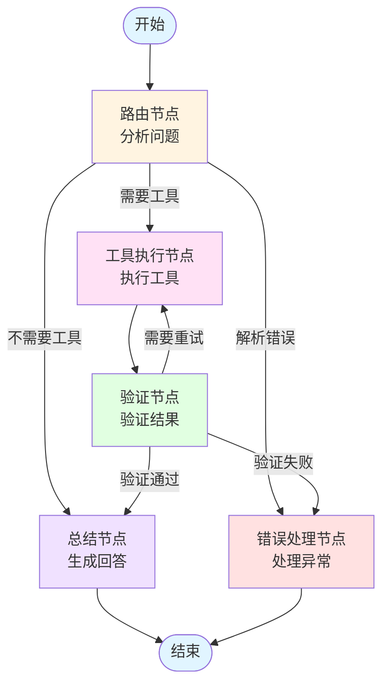

# 高级工具智能体工作流文档

## 📋 概述

`demo_advanced_tools.py` 实现了一个基于 LangGraph 的多节点智能体工作流，相比基础版本（`demo_langgraph_basic.py`）具有更复杂的架构和更智能的决策机制。

## 🏗️ 架构设计

### 1. 多节点工作流

本实现采用**五节点工作流架构**，每个节点负责特定的功能：

#### 节点说明

| 节点名称 | 功能描述 | 职责 |
|---------|---------|------|
| **路由节点 (Router)** | 智能分析用户问题 | 决定使用哪个工具，或直接回答 |
| **工具执行节点 (Execute Tool)** | 执行选定的工具 | 调用具体的工具函数并获取结果 |
| **验证节点 (Validate)** | 验证工具结果 | 检查结果合理性，决定是否需要重试 |
| **总结节点 (Summarize)** | 生成最终回答 | 基于工具结果或直接生成用户友好的回答 |
| **错误处理节点 (Error Handler)** | 处理异常情况 | 统一处理各种错误和异常 |

### 2. 状态结构

工作流使用扩展的状态结构 `AdvancedAgentState`，包含以下字段：

```python
class AdvancedAgentState(TypedDict):
    messages: Annotated[List, add_messages]  # 对话消息历史
    selected_tool: str                        # 选中的工具名称
    tool_input: str                           # 工具输入参数
    tool_result: str                          # 工具执行结果
    route: Literal[...]                       # 当前路由方向
```

#### 状态字段详解

- **`messages`**: 存储完整的对话历史，包括用户问题和AI回答
- **`selected_tool`**: 路由节点选定的工具名称（如 "calculator", "get_weather"）
- **`tool_input`**: 传递给工具的参数（如计算表达式、城市名称等）
- **`tool_result`**: 工具执行后的返回结果
- **`route`**: 控制工作流的下一个节点，可能的值：
  - `"router"`: 路由节点
  - `"execute_tool"`: 工具执行节点
  - `"validate"`: 验证节点
  - `"summarize"`: 总结节点
  - `"error_handler"`: 错误处理节点
  - `"__end__"`: 结束工作流

### 3. 验证机制

验证节点实现了智能的结果验证机制：

#### 验证流程

1. **结果合理性检查**: 验证工具返回的结果是否符合预期
2. **问题匹配度检查**: 确认结果是否真正回答了用户的问题
3. **重试决策**: 如果结果不合理，决定是否需要重新执行工具

#### 验证决策逻辑

```python
if need_retry:
    → 返回工具执行节点（重试）
elif is_valid:
    → 转到总结节点（生成最终回答）
else:
    → 转到错误处理节点（处理异常）
```

### 4. 错误处理

独立的错误处理节点提供统一的异常处理流程：

#### 错误处理场景

- 路由节点解析失败
- 工具执行异常
- 验证节点发现结果不合理且无法重试
- 未知工具调用

#### 错误处理策略

错误处理节点会：
1. 记录错误信息
2. 生成用户友好的错误提示
3. 将错误信息添加到消息历史
4. 优雅地结束工作流

## 🔄 工作流路径

### 完整流程图



### 三种主要路径

#### 路径1：需要工具的正常流程
```
开始 → 路由节点 → 工具执行节点 → 验证节点 → 总结节点 → 结束
```

#### 路径2：不需要工具的直接回答
```
开始 → 路由节点 → 总结节点 → 结束
```

#### 路径3：异常处理流程
```
开始 → 路由节点 → 错误处理节点 → 结束
或
开始 → 路由节点 → 工具执行节点 → 验证节点 → 错误处理节点 → 结束
```

## 🛠️ 可用工具

工作流支持以下工具：

| 工具名称 | 功能 | 使用场景 |
|---------|------|---------|
| `calculator` | 数学计算 | 加减乘除、平方、开方等数学运算 |
| `get_current_time` | 获取当前时间 | 用户询问时间 |
| `web_search` | 网络搜索 | 需要最新信息的查询 |
| `get_weather` | 天气查询 | 查询城市天气信息 |

## 📊 工作流对比

### 基础版本 vs 高级版本

| 特性 | 基础版本 (`demo_langgraph_basic.py`) | 高级版本 (`demo_advanced_tools.py`) |
|------|-----------------------------------|-----------------------------------|
| **节点数量** | 2个（Agent + Tools） | 5个（Router + Execute + Validate + Summarize + ErrorHandler） |
| **状态结构** | 简单（messages + next） | 扩展（messages + selected_tool + tool_input + tool_result + route） |
| **路由机制** | 简单的工具/非工具判断 | 智能路由，支持多种工具选择 |
| **验证机制** | 无 | 有，支持结果验证和重试 |
| **错误处理** | 基础异常捕获 | 独立的错误处理节点 |
| **工作流复杂度** | 线性循环 | 多路径、多决策点 |

## 🚀 使用示例

### 运行代码

```bash
# 确保已设置环境变量
export ARK_API_KEY="your-api-key"
export ARK_MODEL="your-model"
export ARK_BASE_URL="your-base-url"

# 运行示例
python demo_advanced_tools.py
```

### 测试用例

代码包含以下测试用例：

1. **计算问题**: `"计算一下 (25 + 17) × 3 等于多少？"`
   - 路径：路由 → 工具执行（calculator）→ 验证 → 总结

2. **时间查询**: `"现在是什么时间？"`
   - 路径：路由 → 工具执行（get_current_time）→ 验证 → 总结

3. **天气查询**: `"北京的天气怎么样？"`
   - 路径：路由 → 工具执行（get_weather）→ 验证 → 总结

4. **网络搜索**: `"搜索一下 LangChain 的最新信息"`
   - 路径：路由 → 工具执行（web_search）→ 验证 → 总结

5. **数学计算**: `"3的平方加上4的平方再开方是多少？"`
   - 路径：路由 → 工具执行（calculator）→ 验证 → 总结

6. **直接回答**: `"介绍一下你自己"`
   - 路径：路由 → 总结（不需要工具）

## 🔍 节点详细说明

### 1. 路由节点 (Router Node)

**功能**: 智能分析用户问题，决定使用哪个工具或直接回答

**实现逻辑**:
- 使用 LLM 分析用户问题
- 根据问题类型选择工具：
  - 计算问题 → `calculator`
  - 时间问题 → `get_current_time`
  - 搜索需求 → `web_search`
  - 天气查询 → `get_weather`
  - 其他问题 → 直接回答

**输出**: 设置 `selected_tool`、`tool_input` 和 `route` 字段

### 2. 工具执行节点 (Execute Tool Node)

**功能**: 执行路由节点选定的工具

**实现逻辑**:
- 从状态中获取 `selected_tool` 和 `tool_input`
- 调用对应的工具函数
- 将结果存储到 `tool_result`
- 设置 `route` 为 `"validate"`

**错误处理**: 如果工具执行失败，设置 `route` 为 `"error_handler"`

### 3. 验证节点 (Validate Node)

**功能**: 验证工具执行结果的合理性

**实现逻辑**:
- 使用 LLM 检查工具结果是否合理
- 判断结果是否回答了用户问题
- 决定是否需要重试

**决策输出**:
- `need_retry=True` → 返回工具执行节点
- `valid=True` → 转到总结节点
- `valid=False` → 转到错误处理节点

### 4. 总结节点 (Summarize Node)

**功能**: 生成最终的用户友好回答

**实现逻辑**:
- 如果有工具结果：基于工具结果生成回答
- 如果没有工具结果：直接回答用户问题
- 将最终回答添加到消息历史
- 设置 `route` 为 `"__end__"`

### 5. 错误处理节点 (Error Handler Node)

**功能**: 统一处理各种异常情况

**实现逻辑**:
- 获取错误信息（从 `tool_result` 或其他来源）
- 生成用户友好的错误提示
- 将错误信息添加到消息历史
- 设置 `route` 为 `"__end__"`

## 💡 设计优势

### 1. 模块化设计
每个节点职责单一，易于维护和扩展

### 2. 智能决策
路由节点和验证节点都使用 LLM 进行智能决策

### 3. 容错性强
独立的错误处理节点确保异常情况得到妥善处理

### 4. 可扩展性
易于添加新工具和新节点

### 5. 可观测性
每个节点都有日志输出，便于调试和监控

## 📝 代码结构

```
demo_advanced_tools.py
├── 1. 定义扩展状态（State）
├── 2. 定义所有工具
│   ├── calculator
│   ├── get_current_time
│   ├── web_search
│   └── get_weather
├── 3. 创建模型
├── 4. 工具描述函数
├── 5. 创建各个节点（Node）
│   ├── router_node
│   ├── execute_tool_node
│   ├── validate_node
│   ├── summarize_node
│   └── error_handler_node
├── 6. 构建图（Graph）
└── 7. 运行智能体
```

## 🔧 扩展建议

### 添加新工具
1. 使用 `@tool` 装饰器定义新工具函数
2. 将工具添加到 `all_tools` 列表
3. 在路由节点的提示词中添加工具使用规则

### 添加新节点
1. 定义节点函数，接收 `AdvancedAgentState` 并返回更新后的状态
2. 使用 `workflow.add_node()` 添加节点
3. 使用 `workflow.add_edge()` 或 `workflow.add_conditional_edges()` 连接节点

### 优化验证逻辑
可以在验证节点中添加更复杂的验证规则，例如：
- 结果格式检查
- 数值范围验证
- 结果置信度评估

## 📚 相关文档

- [LangGraph 官方文档](https://langchain-ai.github.io/langgraph/)
- [LangChain 工具文档](https://python.langchain.com/docs/modules/tools/)
- 基础版本示例: `demo_langgraph_basic.py`
- 简单工具示例: `demo_with_tools.py`

## 🎯 总结

这个高级工具智能体工作流展示了 LangGraph 的强大能力，通过多节点、多路径的设计，实现了比基础版本更智能、更健壮的智能体系统。它不仅可以处理各种类型的用户问题，还能在出现异常时优雅地处理错误，是一个生产级别的智能体架构示例。

