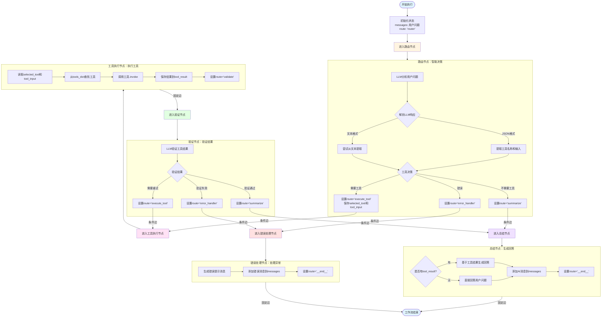
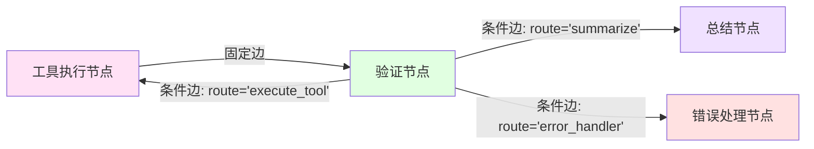

# 图的构建逻辑详解

本文档详细解释 `demo_advanced_tools.py` 中 LangGraph 工作流的构建过程和执行逻辑。

## 一、图的构建步骤

### 步骤1：创建状态图对象

```python
workflow = StateGraph(AdvancedAgentState)
```

**说明**：
- `StateGraph` 是 LangGraph 的核心类，用于构建有状态的工作流
- `AdvancedAgentState` 定义了工作流的状态结构
- 这个步骤创建了一个空的工作流容器

### 步骤2：添加所有节点

```python
workflow.add_node("router", router_node)              # 路由节点
workflow.add_node("execute_tool", execute_tool_node)   # 工具执行节点
workflow.add_node("validate", validate_node)          # 验证节点
workflow.add_node("summarize", summarize_node)        # 总结节点
workflow.add_node("error_handler", error_handler_node) # 错误处理节点
```

**说明**：
- `add_node(name, function)` 将节点函数注册到工作流中
- 每个节点都有一个唯一名称和对应的处理函数
- 此时节点之间还没有连接关系

### 步骤3：设置入口点

```python
workflow.set_entry_point("router")
```

**说明**：
- 指定工作流的起始节点
- 所有执行都从 `router` 节点开始
- 相当于工作流的"大门"

### 步骤4：添加条件边（从路由节点）

```python
def route_decision(state):
    """根据路由节点的决策决定下一步"""
    return state.get("route", "error_handler")

workflow.add_conditional_edges(
    "router",
    route_decision,
    {
        "execute_tool": "execute_tool",  # 需要工具 → 执行工具
        "summarize": "summarize",         # 不需要工具 → 直接总结
        "error_handler": "error_handler"  # 错误 → 错误处理
    }
)
```

**详细解释**：

1. **条件边的作用**：
   - 根据状态动态决定下一个节点
   - 不是固定的连接，而是根据运行时状态选择路径

2. **`route_decision` 函数**：
   - 读取状态中的 `route` 字段
   - 返回一个字符串，表示下一个节点的名称
   - 如果 `route` 不存在，默认返回 `"error_handler"`

3. **路由映射表**：
   ```python
   {
       "execute_tool": "execute_tool",  # 如果 route="execute_tool"，转到 execute_tool 节点
       "summarize": "summarize",         # 如果 route="summarize"，转到 summarize 节点
       "error_handler": "error_handler"  # 如果 route="error_handler"，转到 error_handler 节点
   }
   ```

4. **路由节点的决策逻辑**：
   - 在 `router_node` 函数中，根据 LLM 的分析结果设置 `state["route"]`
   - 如果需要工具：`state["route"] = "execute_tool"`
   - 如果不需要工具：`state["route"] = "summarize"`
   - 如果出错：`state["route"] = "error_handler"`

### 步骤5：添加固定边（从工具执行节点）

```python
workflow.add_edge("execute_tool", "validate")
```

**说明**：
- 这是**固定边**，不是条件边
- 工具执行节点**总是**转到验证节点
- 不需要判断，直接连接

### 步骤6：添加条件边（从验证节点）

```python
def validate_decision(state):
    """根据验证结果决定下一步"""
    return state.get("route", "summarize")

workflow.add_conditional_edges(
    "validate",
    validate_decision,
    {
        "execute_tool": "execute_tool",  # 需要重试 → 重新执行工具
        "summarize": "summarize",         # 验证通过 → 总结
        "error_handler": "error_handler"  # 验证失败 → 错误处理
    }
)
```

**详细解释**：

1. **验证节点的决策逻辑**：
   - 在 `validate_node` 函数中，根据验证结果设置 `state["route"]`
   - 如果验证通过：`state["route"] = "summarize"`
   - 如果需要重试：`state["route"] = "execute_tool"`（形成循环）
   - 如果验证失败：`state["route"] = "error_handler"`

2. **重试机制**：
   - 当 `route="execute_tool"` 时，会返回到工具执行节点
   - 这形成了一个**循环**：`execute_tool → validate → execute_tool`
   - 可以多次重试，直到验证通过或失败

### 步骤7：添加结束边

```python
workflow.add_edge("summarize", END)
workflow.add_edge("error_handler", END)
```

**说明**：
- `END` 是 LangGraph 的常量，表示工作流结束
- 总结节点和错误处理节点都直接结束工作流
- 这是工作流的"出口"

### 步骤8：编译图

```python
return workflow.compile()
```

**说明**：
- `compile()` 将工作流定义编译成可执行的对象
- 编译后的图可以调用 `invoke()` 方法执行
- 这一步会验证图的完整性（例如：所有节点是否都有路径到达）

## 二、完整执行流程图



## 三、状态流转详解

### 状态初始化

```python
initial_state = AdvancedAgentState(
    messages=[HumanMessage(content=query)],  # 用户问题
    selected_tool="",                        # 空字符串
    tool_input="",                           # 空字符串
    tool_result="",                          # 空字符串
    route="router"                           # 初始路由指向router
)
```

### 状态在各节点间的流转

#### 1. 路由节点 → 工具执行节点

**路由节点执行后**：
```python
state = {
    "messages": [用户问题],
    "selected_tool": "calculator",      # 新设置
    "tool_input": "(25 + 17) * 3",     # 新设置
    "tool_result": "",                   # 仍为空
    "route": "execute_tool"              # 新设置，控制下一步
}
```

**条件边判断**：
- `route_decision(state)` 返回 `"execute_tool"`
- 根据映射表，转到 `execute_tool` 节点

#### 2. 工具执行节点 → 验证节点

**工具执行节点执行后**：
```python
state = {
    "messages": [用户问题],
    "selected_tool": "calculator",
    "tool_input": "(25 + 17) * 3",
    "tool_result": "计算结果: (25 + 17) * 3 = 126",  # 新设置
    "route": "validate"                               # 新设置
}
```

**固定边**：
- 直接转到 `validate` 节点（无需判断）

#### 3. 验证节点 → 总结节点（或重试）

**验证节点执行后（验证通过）**：
```python
state = {
    "messages": [用户问题],
    "selected_tool": "calculator",
    "tool_input": "(25 + 17) * 3",
    "tool_result": "计算结果: (25 + 17) * 3 = 126",
    "route": "summarize"  # 新设置
}
```

**条件边判断**：
- `validate_decision(state)` 返回 `"summarize"`
- 根据映射表，转到 `summarize` 节点

**如果验证节点决定重试**：
```python
state["route"] = "execute_tool"  # 设置重试
```
- `validate_decision(state)` 返回 `"execute_tool"`
- 根据映射表，转回 `execute_tool` 节点（形成循环）

#### 4. 总结节点 → 结束

**总结节点执行后**：
```python
state = {
    "messages": [用户问题, AI最终回答],  # 新增AI消息
    "selected_tool": "calculator",
    "tool_input": "(25 + 17) * 3",
    "tool_result": "计算结果: (25 + 17) * 3 = 126",
    "route": "__end__"  # 设置为结束
}
```

**固定边**：
- 直接转到 `END`（工作流结束）

## 四、条件边的详细机制

### 条件边的三要素

1. **源节点**：条件边从哪个节点出发
2. **决策函数**：如何根据状态决定下一个节点
3. **路由映射表**：决策函数的返回值对应的目标节点

### 示例：路由节点的条件边

```python
# 1. 源节点
"router"

# 2. 决策函数
def route_decision(state):
    return state.get("route", "error_handler")

# 3. 路由映射表
{
    "execute_tool": "execute_tool",
    "summarize": "summarize",
    "error_handler": "error_handler"
}
```

**执行流程**：
1. 路由节点执行完毕，更新 `state["route"]`
2. 条件边触发，调用 `route_decision(state)`
3. 函数返回 `state["route"]` 的值（例如 `"execute_tool"`）
4. 在路由映射表中查找对应的目标节点
5. 工作流转到目标节点继续执行

### 条件边 vs 固定边

| 类型 | 语法 | 特点 | 使用场景 |
|------|------|------|----------|
| **固定边** | `add_edge("A", "B")` | 总是转到固定节点 | 确定性的流程，无需判断 |
| **条件边** | `add_conditional_edges("A", decision, mapping)` | 根据状态动态选择 | 需要根据运行时状态决定路径 |

**示例对比**：

```python
# 固定边：工具执行后总是验证
workflow.add_edge("execute_tool", "validate")

# 条件边：验证后根据结果选择路径
workflow.add_conditional_edges(
    "validate",
    validate_decision,
    {
        "execute_tool": "execute_tool",  # 重试
        "summarize": "summarize",         # 通过
        "error_handler": "error_handler"  # 失败
    }
)
```

## 五、循环机制：重试逻辑

### 重试循环的触发



### 重试的条件

在 `validate_node` 中：

```python
validation = json.loads(response.content)
is_valid = validation.get("valid", True)
need_retry = validation.get("need_retry", False)

if need_retry:
    state["route"] = "execute_tool"  # 触发重试
```

### 防止无限循环

**当前实现**：
- 依赖 LLM 的 `need_retry` 判断
- 如果 LLM 一直返回 `need_retry=true`，可能无限循环

**改进建议**：
```python
# 在状态中添加重试计数
class AdvancedAgentState(TypedDict):
    retry_count: int  # 重试次数

# 在验证节点中检查
if need_retry and state.get("retry_count", 0) < 3:
    state["retry_count"] = state.get("retry_count", 0) + 1
    state["route"] = "execute_tool"
else:
    state["route"] = "error_handler"  # 超过重试次数，转到错误处理
```

## 六、图的完整性验证

### LangGraph 的验证规则

1. **所有节点必须可达**：
   - 从入口点必须能到达所有节点（或节点有明确的结束路径）

2. **所有路径必须结束**：
   - 每个节点都必须有路径到达 `END` 或形成有效循环

3. **条件边的返回值必须在映射表中**：
   - 如果决策函数返回 `"unknown"`，但映射表中没有这个键，会报错

### 当前图的验证

✅ **所有节点都有路径**：
- `router` → 入口点
- `execute_tool` → 从 `router` 或 `validate` 可达
- `validate` → 从 `execute_tool` 可达
- `summarize` → 从 `router` 或 `validate` 可达
- `error_handler` → 从 `router` 或 `validate` 可达

✅ **所有路径都能结束**：
- `summarize` → `END`
- `error_handler` → `END`

✅ **条件边映射完整**：
- `route_decision` 返回的值都在映射表中
- `validate_decision` 返回的值都在映射表中

## 七、执行示例：完整流程追踪

### 示例：计算问题

**输入**：`"计算一下 (25 + 17) × 3 等于多少？"`

**执行步骤**：

1. **初始化状态**
   ```python
   {
       "messages": [HumanMessage("计算一下 (25 + 17) × 3 等于多少？")],
       "selected_tool": "",
       "tool_input": "",
       "tool_result": "",
       "route": "router"
   }
   ```

2. **路由节点执行**
   - LLM 分析：需要计算 → 使用 `calculator`
   - 设置状态：
     ```python
     {
         "selected_tool": "calculator",
         "tool_input": "(25 + 17) * 3",
         "route": "execute_tool"
     }
     ```
   - 条件边判断：`route_decision()` 返回 `"execute_tool"` → 转到 `execute_tool` 节点

3. **工具执行节点执行**
   - 调用 `calculator.invoke("(25 + 17) * 3")`
   - 结果：`"计算结果: (25 + 17) * 3 = 126"`
   - 设置状态：
     ```python
     {
         "tool_result": "计算结果: (25 + 17) * 3 = 126",
         "route": "validate"
     }
     ```
   - 固定边：直接转到 `validate` 节点

4. **验证节点执行**
   - LLM 验证：结果合理，验证通过
   - 设置状态：
     ```python
     {
         "route": "summarize"
     }
     ```
   - 条件边判断：`validate_decision()` 返回 `"summarize"` → 转到 `summarize` 节点

5. **总结节点执行**
   - 基于工具结果生成最终回答
   - 添加 AI 消息到 `messages`
   - 设置状态：
     ```python
     {
         "messages": [...原有消息..., AIMessage("根据计算结果，(25 + 17) × 3 = 126")],
         "route": "__end__"
     }
     ```
   - 固定边：转到 `END`

6. **工作流结束**
   - 返回最终状态
   - 提取最后一条 AI 消息作为答案

## 八、关键设计模式

### 1. 状态驱动的工作流

- **核心思想**：通过修改状态中的 `route` 字段控制流程
- **优势**：灵活、可扩展、易于调试

### 2. 条件路由模式

- **核心思想**：使用条件边根据运行时状态动态选择路径
- **优势**：支持复杂的分支逻辑

### 3. 节点职责分离

- **路由节点**：只负责决策，不执行工具
- **工具执行节点**：只负责执行，不验证结果
- **验证节点**：只负责验证，不生成回答
- **总结节点**：只负责生成最终回答

### 4. 错误处理集中化

- **核心思想**：所有错误都转到统一的错误处理节点
- **优势**：错误处理逻辑集中，易于维护

## 九、总结

图的构建逻辑可以概括为：

1. **定义节点**：将处理函数注册为节点
2. **连接节点**：使用固定边或条件边连接节点
3. **控制流程**：通过状态中的 `route` 字段控制条件边的选择
4. **编译执行**：编译图后通过 `invoke()` 执行

这种设计模式使得工作流既灵活又可控，能够处理复杂的业务逻辑。

