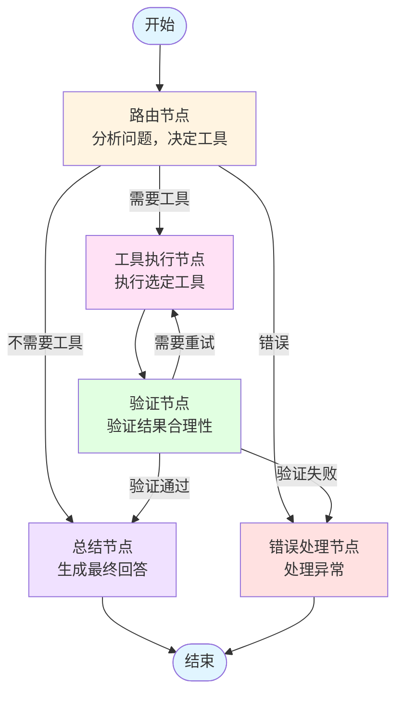
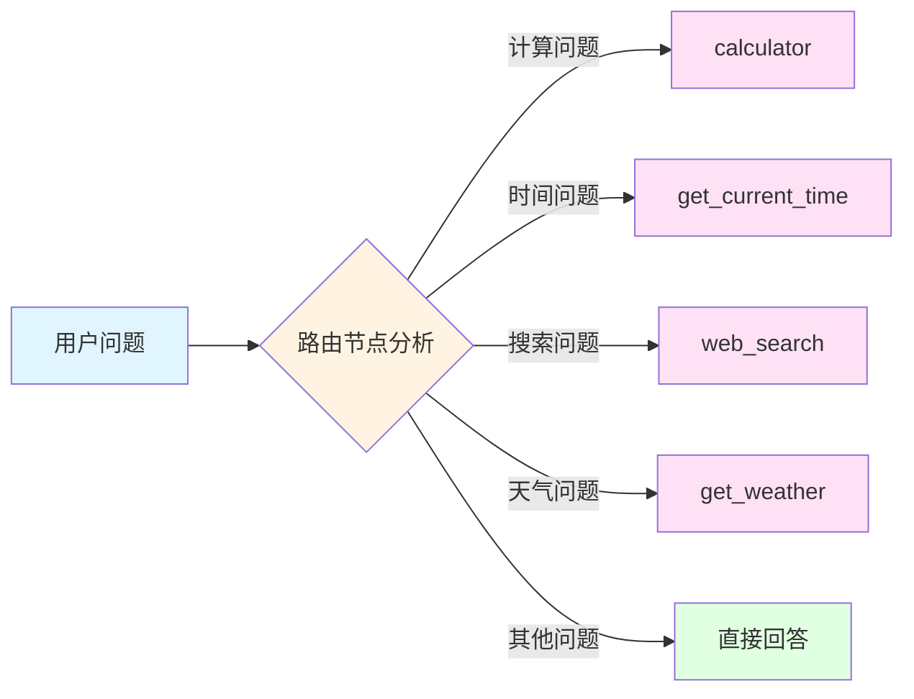
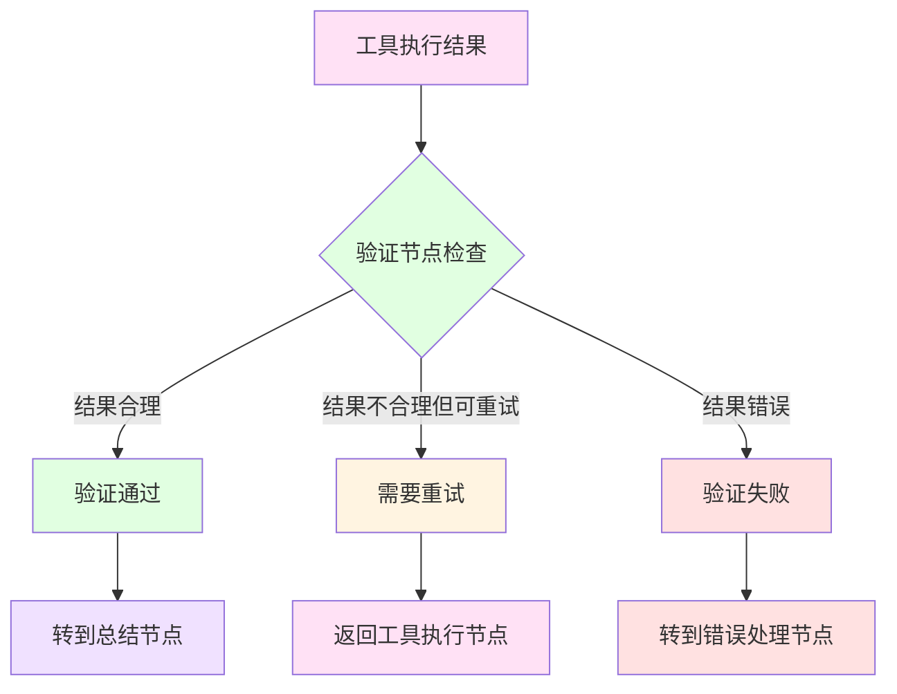

# 高级智能体工作流架构文档

## 概述

`demo_advanced_tools.py` 实现了一个多节点、智能路由的 LangGraph 工作流，相比基础的 Agent-Tools 循环结构，提供了更强大的功能：

- **智能路由**：自动分析问题，决定使用哪个工具
- **结果验证**：验证工具执行结果是否合理
- **错误处理**：统一的异常处理机制
- **重试机制**：支持自动重试失败的执行

## 架构设计

### 1. 多节点工作流

工作流包含 5 个核心节点：

#### 1.1 路由节点 (Router Node)
- **功能**：分析用户问题，智能决定使用哪个工具
- **输入**：用户消息
- **输出**：选定的工具名称和输入参数
- **决策逻辑**：
  - 需要计算 → `calculator`
  - 询问时间 → `get_current_time`
  - 需要搜索 → `web_search`
  - 询问天气 → `get_weather`
  - 不需要工具 → 直接回答

#### 1.2 工具执行节点 (Execute Tool Node)
- **功能**：执行选定的工具
- **输入**：工具名称和输入参数
- **输出**：工具执行结果
- **支持的工具**：
  - `calculator`: 数学计算
  - `get_current_time`: 获取当前时间
  - `web_search`: 网络搜索
  - `get_weather`: 天气查询

#### 1.3 验证节点 (Validate Node)
- **功能**：验证工具执行结果是否合理
- **输入**：用户问题、工具名称、工具输入、工具结果
- **输出**：验证结果（通过/失败/需要重试）
- **验证逻辑**：
  - 检查结果是否合理
  - 判断是否回答了用户问题
  - 决定是否需要重新执行工具

#### 1.4 总结节点 (Summarize Node)
- **功能**：基于工具结果生成最终回答
- **输入**：用户问题和工具结果（如果有）
- **输出**：最终回答消息
- **处理逻辑**：
  - 如果使用了工具，基于工具结果生成回答
  - 如果不需要工具，直接回答用户问题

#### 1.5 错误处理节点 (Error Handler Node)
- **功能**：统一处理异常情况
- **输入**：错误信息
- **输出**：友好的错误提示消息
- **处理场景**：
  - 未知工具
  - 工具执行失败
  - 验证失败
  - 路由解析错误

### 2. 状态结构

工作流使用 `AdvancedAgentState` 作为状态容器：

```python
class AdvancedAgentState(TypedDict):
    messages: Annotated[List, add_messages]  # 对话消息历史
    selected_tool: str                      # 选中的工具名称
    tool_input: str                         # 工具输入参数
    tool_result: str                        # 工具执行结果
    route: Literal[...]                     # 当前路由方向
```

**状态字段说明**：

| 字段 | 类型 | 说明 |
|------|------|------|
| `messages` | `List[Message]` | 对话消息历史，包含用户问题和AI回答 |
| `selected_tool` | `str` | 路由节点选定的工具名称 |
| `tool_input` | `str` | 传递给工具的输入参数 |
| `tool_result` | `str` | 工具执行后的结果 |
| `route` | `Literal` | 控制工作流的下一个节点，可选值：`router`, `execute_tool`, `validate`, `summarize`, `error_handler`, `__end__` |

### 3. 验证机制

验证节点通过 LLM 智能判断工具结果：

1. **合理性检查**：判断结果是否符合预期
2. **相关性检查**：判断结果是否回答了用户问题
3. **重试决策**：如果结果不合理，决定是否重试

**验证流程**：
```
工具执行 → 验证节点 → {
    通过 → 总结节点
    失败 → 错误处理节点
    需要重试 → 工具执行节点（循环）
}
```

### 4. 错误处理

错误处理节点统一处理所有异常情况：

- **路由错误**：无法识别工具或解析失败
- **工具错误**：工具执行异常
- **验证错误**：结果验证失败

所有错误都会生成友好的错误提示，并结束工作流。

## 工作流路径

### 路径1：需要工具的正常流程
```
开始 → 路由节点 → 工具执行节点 → 验证节点 → 总结节点 → 结束
```

### 路径2：不需要工具的直接回答
```
开始 → 路由节点 → 总结节点 → 结束
```

### 路径3：需要重试的流程
```
开始 → 路由节点 → 工具执行节点 → 验证节点 → 工具执行节点（重试）→ 验证节点 → 总结节点 → 结束
```

### 路径4：错误处理流程
```
开始 → 路由节点 → [错误处理节点] → 结束
或
开始 → 路由节点 → 工具执行节点 → 验证节点 → 错误处理节点 → 结束
```

## 完整流程图



## 详细节点流程图

### 路由节点决策流程



### 验证节点决策流程



## 与基础版本的区别

### demo_langgraph_basic.py（基础版）
- **结构**：简单的 Agent ↔ Tools 循环
- **节点数**：2 个节点（Agent、Tools）
- **状态**：简单的 `messages` 和 `next` 字段
- **特点**：直接执行工具，无验证机制

### demo_advanced_tools.py（高级版）
- **结构**：多节点、多路径的智能工作流
- **节点数**：5 个节点（路由、执行、验证、总结、错误处理）
- **状态**：丰富的状态字段，支持更复杂的流程控制
- **特点**：
  - 智能路由分析
  - 结果验证机制
  - 自动重试功能
  - 统一错误处理

## 使用示例

### 示例1：计算问题
```python
# 运行高级智能体
result = run_advanced_agent("计算一下 (25 + 17) × 3 等于多少？")
print(result)
```

**执行流程**：
1. 路由节点分析问题，决定使用 `calculator` 工具
2. 工具执行节点计算 `(25 + 17) × 3`
3. 验证节点检查计算结果是否合理
4. 总结节点生成最终回答："计算结果为 126"

### 示例2：时间查询
```python
result = run_advanced_agent("现在是什么时间？")
```

**执行流程**：
1. 路由节点识别为时间查询，决定使用 `get_current_time`
2. 工具执行节点获取当前时间
3. 验证节点验证时间格式是否正确
4. 总结节点生成友好回答

### 示例3：不需要工具的问题
```python
result = run_advanced_agent("介绍一下你自己")
```

**执行流程**：
1. 路由节点分析，决定不需要工具
2. 直接转到总结节点生成回答

## 技术要点

### 1. 状态管理
- 使用 `TypedDict` 定义强类型状态
- 通过 `Annotated` 和 `add_messages` 管理消息历史
- 使用 `Literal` 类型限制路由值

### 2. 条件路由
- 使用 `add_conditional_edges` 实现动态路由
- 通过 `route` 字段控制流程方向
- 支持多路径工作流

### 3. 工具集成
- 使用 `@tool` 装饰器定义工具
- 工具字典快速查找和执行
- 统一的工具接口

### 4. LLM 决策
- 路由节点使用 LLM 分析问题
- 验证节点使用 LLM 判断结果合理性
- 总结节点使用 LLM 生成最终回答

### 5. 错误恢复
- 通过重试机制提高成功率
- 统一的错误处理流程
- 友好的错误提示

## 代码结构

```
demo_advanced_tools.py
├── 1. 状态定义
│   └── AdvancedAgentState
├── 2. 工具定义
│   ├── calculator
│   ├── get_current_time
│   ├── web_search
│   └── get_weather
├── 3. 模型配置
│   └── ChatOpenAI
├── 4. 节点实现
│   ├── router_node (路由节点)
│   ├── execute_tool_node (工具执行节点)
│   ├── validate_node (验证节点)
│   ├── summarize_node (总结节点)
│   └── error_handler_node (错误处理节点)
├── 5. 图构建
│   └── build_advanced_agent()
└── 6. 运行函数
    └── run_advanced_agent()
```

## 扩展建议

### 1. 添加更多工具
- 扩展工具集，支持更多功能
- 例如：数据库查询、文件操作、API 调用等

### 2. 优化验证逻辑
- 使用更精确的验证规则
- 添加工具特定的验证逻辑
- 支持自定义验证函数

### 3. 添加缓存机制
- 缓存工具结果，提高效率
- 避免重复执行相同计算
- 支持缓存过期策略

### 4. 支持并行执行
- 多个工具可以并行执行
- 提高工作流效率
- 需要处理依赖关系

### 5. 添加监控
- 集成 LangSmith 进行工作流监控
- 记录每个节点的执行时间
- 分析工作流性能

### 6. 增强错误处理
- 更详细的错误分类
- 错误恢复策略
- 错误日志记录

## 总结

`demo_advanced_tools.py` 展示了一个完整的多节点 LangGraph 工作流实现，通过智能路由、结果验证、错误处理等机制，构建了一个更加健壮和智能的 AI 智能体系统。相比基础版本，它提供了：

- ✅ 更智能的决策能力
- ✅ 更可靠的执行保障
- ✅ 更完善的错误处理
- ✅ 更灵活的工作流控制

这个架构可以作为构建更复杂 AI 应用的基础模板。

