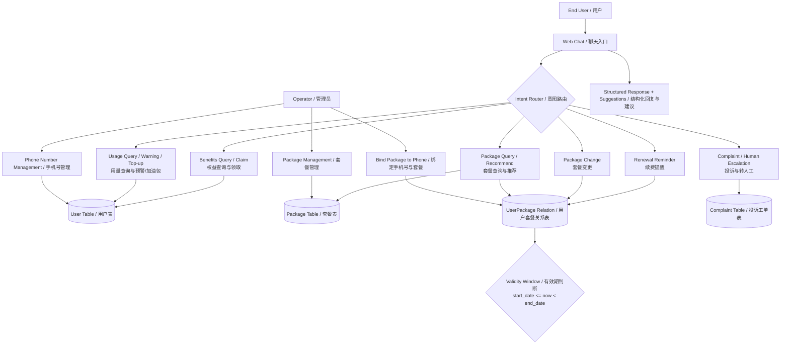
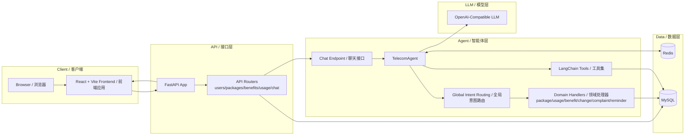

# Telecom Package Agent

An end-to-end telecom support application with:
- A FastAPI backend
- A React + Vite frontend
- An LLM-powered agent for package, usage, benefits, complaints, and renewal workflows

This README is English-first. A Chinese quick guide is included at the end.

## Table of Contents
- Overview
- Core Features
- Diagrams / 图表
- Open-Source README
- Tech Stack
- Project Structure
- Prerequisites
- Configuration
- Quick Start
- Useful Commands
- API Groups
- Agent Scenarios
- Development Docs
- Troubleshooting
- 中文快速说明

## Overview
This project helps telecom operators and developers test AI-assisted customer service flows, including:
- Chat consultation
- Phone number management
- Package management and assignment
- Benefits claiming
- Usage tracking
- Complaint handling and escalation

## Core Features
- AI chat assistant with intent routing:
  - package / usage / benefit / change / complaint / reminder
- Package management:
  - create, update, delete, paged query, detail
- Phone number management:
  - create, update, delete, paged query
- User-package relation management:
  - assign/switch package by user ID
  - current package detection by time validity
  - package history pagination
- Dashboard:
  - current package, usage summary, benefit summary, usage trend

## Diagrams / 图表

### Functional Business Flow (Mermaid) / 功能业务流程图（Mermaid）



### System Architecture Flow (Mermaid) / 系统架构流程图（Mermaid）



## Open-Source README
For an external/open-source focused version (including business and architecture diagrams):
- [README.opensource.md](README.opensource.md)

## Tech Stack
- Backend:
  - Python, FastAPI, SQLAlchemy, Alembic, Redis, LangChain
- Frontend:
  - React 18, TypeScript, Vite 5, Tailwind CSS, Ant Design, Axios
- Database:
  - MySQL

## Project Structure
```text
telecom-package-agent/
├── backend/
│   ├── app/
│   │   ├── api/               # REST endpoints
│   │   ├── agent/             # agent, tools, prompt, intent handlers
│   │   ├── core/              # config
│   │   ├── models/            # SQLAlchemy models
│   │   ├── schemas/           # Pydantic schemas
│   │   └── services/          # business logic
│   ├── requirements.txt
│   ├── start                  # backend process manager (recommended)
│   └── start.sh               # compatibility wrapper -> ./start
├── frontend/
│   ├── src/
│   └── package.json
├── migrations/                # Alembic migrations
├── scripts/
│   ├── init_db.sql
│   └── test_llm_connectivity.py
└── docs/
    ├── backend-dev.md
    ├── frontend-dev.md
    └── agent-scenarios.md
```

## Prerequisites
- Python 3.10+ (recommended 3.11+)
- Node.js 18+
- Yarn 1.22+
- MySQL 5.7+ / 8.0+
- Redis 5.0+ (recommended; used for chat memory/history)

## Configuration
Create `.env` in project root (or `backend/.env`).

```env
# Backend
SQLALCHEMY_DATABASE_URI=mysql+pymysql://<user>:<password>@localhost:3306/telecom_package_agent?charset=utf8mb4
REDIS_URL=redis://localhost:6379/0
OPENAI_API_KEY=sk-xxxx
OPENAI_BASE_URL=https://your-openai-compatible-host/v1

# Optional backend metadata
APP_NAME=telecom-package-agent
API_V1_PREFIX=/api/v1

# Frontend
VITE_API_BASE_URL=http://localhost:8005
```

Notes:
- `OPENAI_BASE_URL` supports OpenAI-compatible endpoints.
- If `OPENAI_BASE_URL` is empty, official OpenAI URL is used by client logic.

## Quick Start

### 1) Backend setup
```bash
cd backend
python3 -m venv .venv
source .venv/bin/activate
pip install -r requirements.txt
```

### 2) Initialize database
From project root:
```bash
mysql -u root -p < scripts/init_db.sql
PYTHONPATH=backend backend/.venv/bin/python -m alembic upgrade head
```

### 3) Start backend
```bash
cd backend
chmod +x start
./start start
```

Backend default URL:
- `http://localhost:8005`
- Health: `http://localhost:8005/health`
- Swagger: `http://localhost:8005/docs`

### 4) Frontend setup and run
From project root:
```bash
cd frontend
yarn install
yarn dev
```

Frontend default URL:
- `http://localhost:5173`

## Useful Commands

### Backend process manager
```bash
cd backend
./start start
./start status
./start restart
./start stop
```

### Frontend
```bash
cd frontend
yarn dev
yarn build
yarn preview
```

### LLM connectivity test
From project root:
```bash
python3 scripts/test_llm_connectivity.py
python3 scripts/test_llm_connectivity.py --model gpt-4o-mini
```

## API Groups
Main API prefix: `/api/v1`

- Users / phone numbers:
  - `/users` (paged list + CRUD)
- Packages:
  - `/packages` (list + CRUD + recommend + paged)
- User package relation:
  - `/users/{user_id}/packages/current`
  - `/users/{user_id}/packages/history`
  - `/users/{user_id}/packages/assign`
- Benefits:
  - `/benefits/pending/{user_id}`
  - `/benefits/claim`
- Usage:
  - `/usage/current/{user_id}`
  - `/usage/history/{user_id}`
- Chat:
  - `/chat`
  - `/chat/transfer-human`
  - `/chat/history/{session_id}`

## Agent Scenarios
A full scenario matrix and sample cases are documented here:
- [docs/agent-scenarios.md](docs/agent-scenarios.md)

## Development Docs
- Backend setup and workflow:
  - [docs/backend-dev.md](docs/backend-dev.md)
- Frontend setup and workflow:
  - [docs/frontend-dev.md](docs/frontend-dev.md)

## Troubleshooting
- Backend says `Address already in use`:
  - run `./backend/start stop`, then retry
- Chat endpoint fails:
  - verify `OPENAI_API_KEY` and `OPENAI_BASE_URL`
  - run `python3 scripts/test_llm_connectivity.py`
- Frontend cannot reach backend:
  - check `VITE_API_BASE_URL` (should match backend, default `8005`)
  - ensure backend is running
- Python typing errors on startup:
  - use Python 3.10+ in backend virtual environment

---

## 中文快速说明

### 项目简介
这是一个“运营商套餐 AI 助手”项目，包含后端 FastAPI、前端 React，以及多场景 Agent 能力（套餐、用量、权益、投诉、续费提醒等）。

### 快速启动
1. 配置环境变量（根目录 `.env` 或 `backend/.env`）：
   - `SQLALCHEMY_DATABASE_URI`
   - `REDIS_URL`
   - `OPENAI_API_KEY`
   - `OPENAI_BASE_URL`
   - `VITE_API_BASE_URL=http://localhost:8005`
2. 安装后端依赖：
   - `cd backend`
   - `python3 -m venv .venv`
   - `source .venv/bin/activate`
   - `pip install -r requirements.txt`
3. 初始化数据库（在项目根目录）：
   - `mysql -u root -p < scripts/init_db.sql`
   - `PYTHONPATH=backend backend/.venv/bin/python -m alembic upgrade head`
4. 启动后端：
   - `cd backend`
   - `./start start`
5. 启动前端：
   - `cd frontend`
   - `yarn install`
   - `yarn dev`

### 常用地址
- 后端健康检查：`http://localhost:8005/health`
- 后端文档：`http://localhost:8005/docs`
- 前端页面：`http://localhost:5173`

### 相关文档
- 后端开发文档：[docs/backend-dev.md](docs/backend-dev.md)
- 前端开发文档：[docs/frontend-dev.md](docs/frontend-dev.md)
- Agent 场景清单：[docs/agent-scenarios.md](docs/agent-scenarios.md)
