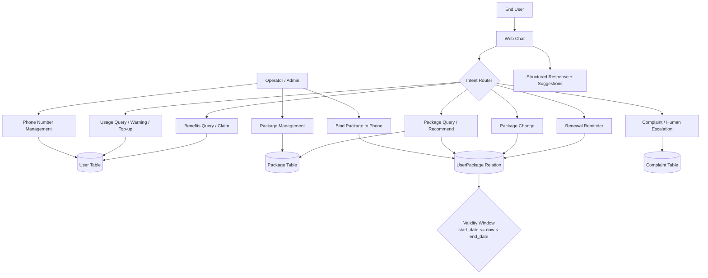
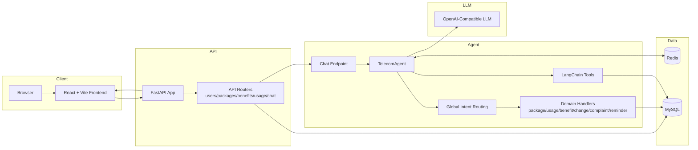

# Telecom Package Agent (Open Source Edition)

Production-style demo for AI-assisted telecom customer operations:
- Phone number lifecycle management
- Package lifecycle management
- User-package binding with validity windows
- Benefits and usage operations
- Agent-driven chat, complaints, and reminders

## Contents
- Project Scope
- Functional Business Flow
- System Architecture Flow
- Key Modules
- API Surface
- Local Development
- Contribution Guide
- Open-Source Release Checklist

## Project Scope
This project is designed as a full-stack reference for:
- Telecom customer support automation
- LLM intent-routing and domain handling
- FastAPI + React integration patterns
- Operable management pages for real workflows

## Functional Business Flow



## System Architecture Flow



## Key Modules
- Backend:
  - `backend/app/api`: REST APIs
  - `backend/app/agent`: chat agent, prompt, tools, intent handlers
  - `backend/app/services`: core business logic
  - `backend/app/models`: SQLAlchemy models
- Frontend:
  - `frontend/src/pages/Users`: phone number management
  - `frontend/src/pages/Packages`: package management + binding
  - `frontend/src/pages/Chat`: agent interaction
  - `frontend/src/pages/Dashboard`: operational metrics view

## API Surface
Main prefix: `/api/v1`

- Users / phone numbers: `/users`
- Packages: `/packages`
- User package relation:
  - `/users/{user_id}/packages/current`
  - `/users/{user_id}/packages/history`
  - `/users/{user_id}/packages/assign`
- Benefits: `/benefits/*`
- Usage: `/usage/*`
- Chat:
  - `/chat`
  - `/chat/transfer-human`
  - `/chat/history/{session_id}`

For detailed scenario matrix:
- [docs/agent-scenarios.md](docs/agent-scenarios.md)

## Local Development

1. Backend
```bash
cd backend
python3 -m venv .venv
source .venv/bin/activate
pip install -r requirements.txt
```

2. Database migration (from repository root)
```bash
mysql -u root -p < scripts/init_db.sql
PYTHONPATH=backend backend/.venv/bin/python -m alembic upgrade head
```

3. Start backend
```bash
cd backend
./start start
```

4. Frontend
```bash
cd frontend
yarn install
yarn dev
```

## Contribution Guide
- Fork the repository
- Create a feature branch
- Keep changes scoped and documented
- Run build checks before PR:
  - `python3 -m compileall backend/app`
  - `yarn --cwd frontend build`
- Open PR with:
  - problem statement
  - change summary
  - verification notes

## Open-Source Release Checklist
- [ ] Add a `LICENSE` file (required before public distribution)
- [ ] Add repository topics and tags
- [ ] Add CI checks (lint/build/tests)
- [ ] Add issue/PR templates
- [ ] Add `SECURITY.md` and `CODE_OF_CONDUCT.md` (recommended)

---

If you prefer the default project README with bilingual quick-start:
- [README.md](README.md)
